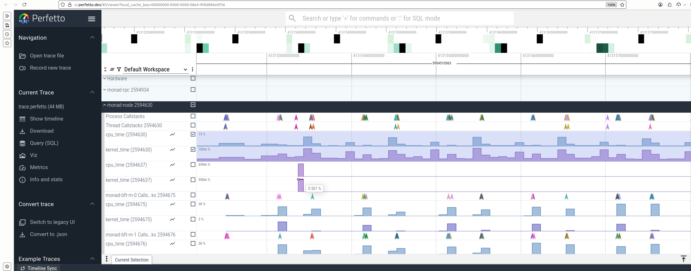
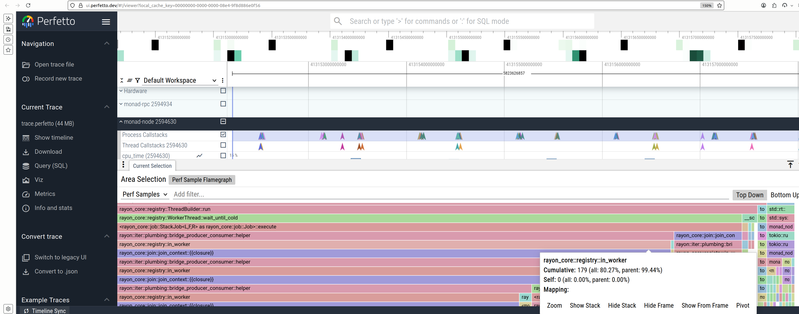
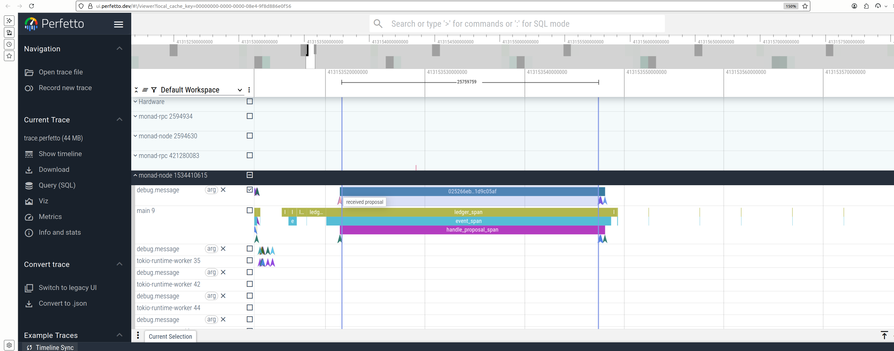

# manytrace

[![Build Status][actions-badge]][actions-url]
[![GPL licensed][gpl-badge]][gpl-url]

[actions-badge]: https://github.com/category-labs/manytrace/workflows/CI/badge.svg
[actions-url]: https://github.com/category-labs/manytrace/actions?query=workflow%3ACI
[gpl-badge]: https://img.shields.io/badge/license-GPL-blue.svg
[gpl-url]: LICENSE

## setup

for configuration examples see `reference.toml` or the monad-specific example at `config.toml`. 
after collecting traces, view them in perfetto ui.

to start collecting data:
```bash
sudo manytrace config.toml  # run until ctrl-c
# or
sudo manytrace config.toml -d 10s  # collect for 10 seconds
```

then open the generated `trace.perfetto` file at https://ui.perfetto.dev/  
note: the ui runs a wasm extension locally - nothing is uploaded to servers

### extensions

#### cpu utilization


measures the average cpu time for each thread within sampling intervals.
the frequency parameter controls how often metrics are computed, with a frequency of 10 hz meaning measurements every 100ms.
distinguishes between userspace time and kernel time (syscalls).
interrupt time is not subtracted from thread time, so measurements may include time spent handling interrupts.

```toml
[bpf.cpu_util]
frequency = 10  # sampling frequency in hz
filter_process = ["monad-rpc", "monad-node"]
```

#### profiler


samples call stacks at regular intervals to identify where cpu time is spent.
captures both kernel and userspace stack traces similar to `perf record`.
the frequency parameter sets how many stack samples to collect per second.

profiled applications must be compiled with frame pointers as bpf doesn't support other stack walking methods yet.
without frame pointers, profiles will contain unknown or incorrect samples.

```toml
[bpf.profiler]
frequency = 99  # samples per second
kernel_samples = true
user_samples = true
filter_process = ["monad-rpc", "monad-node"]
```

#### scheduler tracing
provides detailed visibility into thread scheduling behavior by tracking when threads are running on cpu, when they become blocked and why, and when they are ready to run but waiting to be scheduled.
**warning**: this extension has significant overhead due to the high frequency of scheduling events.
only enable it for short durations (up to 5 seconds) when debugging specific performance issues.

each span represents a period of cpu execution and includes kernel function names where the thread was blocked.
the cpu label indicates which core the thread was scheduled on, making it easy to track cpu migrations and identify scheduling delays.
the scheduler timeline distinguishes `running`, `runnable` (ready but waiting for cpu), and `blocked` (sleeping or waiting for a resource); runnable spans include whether they followed a wakeup, preemption, or another `TASK_RUNNING` switch.

```toml
[bpf.schedtrace]
filter_process = []
```

#### performance counters
collects hardware performance counter statistics like cpu cycles, instructions, cache misses, and branch predictions.

```toml
[bpf.perfcounter]
frequency = 100
counters = ["cpu-cycles", "instructions", "cache-misses", "ipc"]
# supported counters: cpu-cycles, instructions, branches, cache-misses, 
# page-faults, context-switches, cpu-migrations, ipc
```

#### network tracking

collects successful TCP and UDP application payload bytes. counters are aggregated in BPF maps
and sampled from userspace, so network tracking does not use periodic per-CPU interrupts or a
ring buffer. host byte throughput is the low-overhead default; process and peer aggregation are
independent opt-in scopes.

```toml
[bpf.nettrack]
frequency = 5
peer_frequency = 1
scaled = true
protocols = ["tcp", "udp"]
directions = ["send", "receive"]
scopes = ["host"] # add "process" or "peer" for more detail
metrics = ["bytes"] # optional: "operations", "errors"
```

process-name filters require `bpf.thread_tracker`. peer tracks contain remote IP addresses and
ports and may make traces sensitive; their kernel-map and Perfetto cardinality are bounded by
`max_peer_entries` and `max_peer_tracks`.

#### block I/O tracking

collects completed block-device throughput, IOPS, errors, queue/service/total latency, queue
depth, busy time, and time with requests waiting to issue. cumulative BPF maps are sampled at
`frequency`, so the default aggregate mode does not send an event for every request. each
physical device becomes a Perfetto timeline, with filesystem and mount labels resolved in
userspace when the request identifies a mounted partition.

```toml
[bpf.block_io]
frequency = 10
operations = ["read", "write"]
metrics = ["throughput", "iops", "latency", "saturation", "errors"]
devices = ["nvme0n1"] # optional: device name, /dev path, or major:minor
timeline = false
```

set `timeline = true` to add issue-to-completion request spans. this opt-in mode uses a ring
buffer; bound its overhead with `timeline_sample_every`, `timeline_min_latency_us`, `ringbuf`,
and `max_requests`. aggregate counters remain unsampled and do not depend on the ring buffer.
throughput/error-only configurations also bypass per-request lifecycle state; enabling IOPS,
latency, saturation, or timeline spans turns that correlation on.

throughput is completed block payload, not logical filesystem syscall bytes: cached writes appear
when writeback reaches the block layer, and cached reads do not appear. queue latency is time not
being serviced, service latency is cumulative issue-to-completion time across attempts, and total
latency is first observation to final completion. `busy_percent` means at least one request is in
flight; `saturated_percent` means at least one request is queued waiting to issue. percentile
counters are approximate upper bounds from log2 microsecond histograms. layered devices can appear
on multiple tracks, so their byte totals should not be added without accounting for the stack.
request PID/comm attribution is best effort: buffered writeback and merged I/O can be owned by a
kernel worker rather than the application. `max_inflight` and `max_queued` are lifetime high-water
marks for the collector run.

#### user tracing


captures rust tracing spans including application-level trace data, structured span events, and log filtering.

log_filter uses rust's EnvFilter syntax, supporting more than simple levels (e.g., "module=debug,other=info").
random_process_id prevents overlapping process ids between different containers.

```toml
[[user]]
socket = "/path/to/node.sock"
log_filter = "TRACE"
random_process_id = true  # prevents pid conflicts between containers

[[user]]
socket = "/path/to/rpc.sock"
log_filter = "TRACE"
random_process_id = true
```

## License

Licensed under the GNU General Public License ([LICENSE](LICENSE) or https://www.gnu.org/licenses/gpl-3.0.html).
