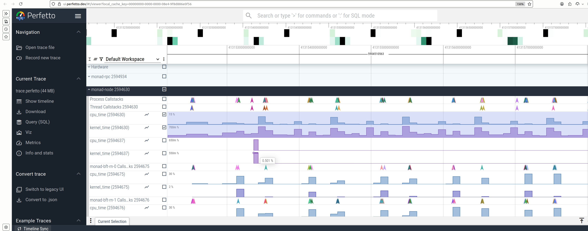

# manytrace

[![Build Status][actions-badge]][actions-url]
[![GPL licensed][gpl-badge]][gpl-url]

[actions-badge]: https://github.com/dshulyak/manytrace/workflows/CI/badge.svg
[actions-url]: https://github.com/dshulyak/manytrace/actions?query=workflow%3ACI
[gpl-badge]: https://img.shields.io/badge/license-GPL-blue.svg
[gpl-url]: LICENSE

## setup

for configuration examples see `reference.toml` or the monad-specific example at `config.toml`. 
after collecting traces, view them in perfetto ui.

to start collecting data:
```bash
sudo manytrace config.toml  # run until ctrl-c
# or
sudo manytrace config.toml -d 10s  # collect for 10 seconds
```

then open the generated `trace.perfetto` file at https://ui.perfetto.dev/  
note: the ui runs a wasm extension locally - nothing is uploaded to servers

### extensions

#### cpu utilization


measures the average cpu time for each thread within sampling intervals.
the frequency parameter controls how often metrics are computed, with a frequency of 10 hz meaning measurements every 100ms.
distinguishes between userspace time and kernel time (syscalls).
interrupt time is not subtracted from thread time, so measurements may include time spent handling interrupts.

```toml
[bpf.cpu_util]
frequency = 10  # sampling frequency in hz
filter_process = ["monad-rpc", "monad-node"]
```

#### profiler


samples call stacks at regular intervals to identify where cpu time is spent.
captures both kernel and userspace stack traces similar to `perf record`.
the frequency parameter sets how many stack samples to collect per second.

profiled applications must be compiled with frame pointers as bpf doesn't support other stack walking methods yet.
without frame pointers, profiles will contain unknown or incorrect samples.

```toml
[bpf.profiler]
frequency = 99  # samples per second
kernel_samples = true
user_samples = true
filter_process = ["monad-rpc", "monad-node"]
```

#### user tracing


captures rust tracing spans including application-level trace data, structured span events, and log filtering.

log_filter uses rust's EnvFilter syntax, supporting more than simple levels (e.g., "module=debug,other=info").
random_process_id prevents overlapping process ids between different containers.

```toml
[[user]]
socket = "/path/to/node.sock"
log_filter = "TRACE"
random_process_id = true  # prevents pid conflicts between containers

[[user]]
socket = "/path/to/rpc.sock"
log_filter = "TRACE"
random_process_id = true
```

## License

Licensed under the GNU General Public License ([LICENSE](LICENSE) or https://www.gnu.org/licenses/gpl-3.0.html).